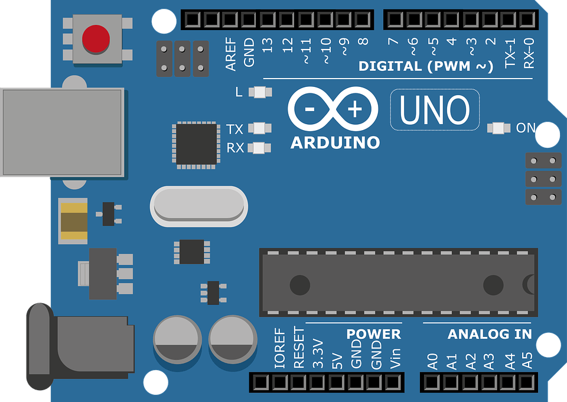

# Arduino


## Visão geral

_Arduino_ é uma plataforma de prototipagem eletrônica, criada em 2005 por um grupo de 5 pesquisadores : Massimo Banzi, David Cuartielles, Tom Igoe, Gianluca Martino e David Mellis.  
Ela usa do conceito de hardware livre, o que significa que qualquer um está livre a estudar a arquitetura do hardware (as placas de prototipagem e seus componentes) e reproduzir, contanto que não faça uso da marca registrada Arduino.  

As placas de prototipação possuem diversos componentes, como os **pinos** de entrada/saída Digitais e Analógicos, **portas** e interfaces (USB-B, micro-USB, Fonte de Tensão), **microcontroladores** Atmel (ATmega8, ATmega328, ATmega1280), um **cristal oscilador** para realizar as funções do sistema em sincronia com por meio dos "clocks" e suporte a uma **modificação das linguagens de programação C/C++** com bibliotecas e funções próprias.  
Além das placas, a plataforma possui projetos opensource, bibliotecas, interfaces para sensores e softwares como o Arduino IDE para o desenvolvimento de programas para as placas de prototipagem.  

O que torna o Arduino tão especial é sua acessibilidade, uma vez é possível realizar diversos projetos usando componentes, shields (placas que permitem adicionar funcionalidades às placas Arduino), circuitos integrados e sensores amplamente aplicáveis rotineiramente a um baixo cursto em comparação com outras plataformas e tecnologias.  


## Arquitetura

<div align="center">

###### Arduino Uno:  

  

</br>

###### Pinagem e Arquitetura:  

  

</br>

  

</br>

###### Modelos:  

  

</br>
</div>

## Modelos

Dentre os diversos modelos de placas, os mais conhecidos são:

* Arduino Uno  
* Arduino Mega  
* Arduino Leonardo  
* Arduino Micro  
* Arduino Nano  
* Arduino Mini  


### Diferença entre Microcontrolador e Microprocessador

* Microprocessador - conjunto de componentes [ unidades lógica, aritmética, unidade de controle, com diversos registradores de memória além das entradas e saídas ] que executam diversas tarefas/processos simultaneamente de programas diferentes, podendo adaptar uma tarefa de acordo com a situação do sistema.  
* Microcontrolador - chip único que realiza todas as funções dos componentes do microprocessador [ chip All-in-One ] que executa apenas um processo pré-programado e, por isso, geralmente possui capacidade de armazenamento e processamento inferior aos microprocessadores.  

Ambas as placas possuem chipset, processador com 1 ou mais núcleos, memórias RAM, memória ROM, EEPROM, memória Flash, unidades de armazenamento (dado o tamanho e as interfaces mais simples das placas, o mais comum é o MicroSD)...  

Comparando arquiteturas:  
</br>

<div align="center">

  

</div>

_Arduino Duemilanove (2009, em italiano), que possui um controlador ATmega168, um clock de 16MHz, 2kB de memória RAM, 32kB de memória flash, 14 portas digitais e 6 entradas analógicas (20 pinos), opera em 3.3V ou 5V (entretanto podendo receber de 6 a 20 Volts) a 40mA ou 50mA._  
_Raspberry Pi 1 Model B+, com um processador Broadcom de núcleo único e 700 MHz, 512 MB de memória RAM padrão DDR2, 40 pinos, quatro portas USB 2.0, saída HDMI, slot para microSD, baixo consumo de energia (entre 0,5 e 1 watt), interface de conexão Ethernet, interface para câmera e tela, além de saída de som P2._  

## Exemplos de Código:

###### Acender LEDs RGB em sequência

```
int counter;

void setup()
{
	pinMode(10, OUTPUT);
	pinMode(12, OUTPUT);
	pinMode(9, OUTPUT);
	pinMode(5, OUTPUT);
}

void loop()
{
	digitalWrite(10, HIGH);
	for (counter = 0; counter < 10; ++counter) {
		digitalWrite(12, HIGH);
		digitalWrite(9, LOW);
		digitalWrite(5, LOW);
		delay(1000); // Wait for 1000 millisecond(s)
		digitalWrite(12, LOW);
		digitalWrite(9, HIGH);
		digitalWrite(5, LOW);
		delay(1000); // Wait for 1000 millisecond(s)
		digitalWrite(12, LOW);
		digitalWrite(9, LOW);
		digitalWrite(5, HIGH);
		delay(1000); // Wait for 1000 millisecond(s)
	}
	digitalWrite(10, LOW);
}
```

<div align="center">

  

</div>

</br>

###### Sensor de Distância Ultrassônico

```
#define SIGNAL A0
#define RED 6
#define GREEN 5
#define BLUE 3 // constantes com os identificadores dos pinos

int distancia = 0;

long lerDistanciaUltrassonica(int pinoAcionador, int pinoEco)
{
	pinMode(pinoAcionador, OUTPUT); // limpar o acionador o deixando em LOW
	digitalWrite(pinoAcionador, LOW);
	delayMicroseconds(2);

	// deixar o acionador em HIGH por 10 microsegundos
	digitalWrite(pinoAcionador, HIGH);
	delayMicroseconds(10);
	digitalWrite(pinoAcionador, LOW);

	// ler o pino de eco e retornar o tempo de viagem da onda sonora em microsegundos
	pinMode(pinoEco, INPUT);
	return pulseIn(pinoEco, HIGH);
}

void setup()
{
	Serial.begin(9600); // iniciar troca de dados com o monitor serial a 9600 bauds
	pinMode(RED, OUTPUT); // definir pinos dos leds como saida
	pinMode(GREEN, OUTPUT);
	pinMode(BLUE, OUTPUT);
}

void loop()
{
	distancia = 0.01723 * lerDistanciaUltrassonica(SIGNAL, SIGNAL); // conversao de tempo de viagem recebido do eco para 'cm'

	Serial.print("Proximidade: ");
	Serial.print(distancia);
	Serial.println("cm");
	
	if (distancia <= 85)
	{
		digitalWrite(GREEN, LOW);
		digitalWrite(BLUE, LOW);
		digitalWrite(RED, HIGH);
	}
	else if (distancia > 85 && distancia <= 170)
	{
		digitalWrite(RED, LOW);
		digitalWrite(BLUE, LOW);
		digitalWrite(GREEN, HIGH);
	}
	else // distancia > 170
	{
		digitalWrite(RED, LOW);
		digitalWrite(GREEN, LOW);
		digitalWrite(BLUE, HIGH);
	}

	delay(10); // Delay para evitar alto custo de processamento
}


```

<div align="center">

  

</div>

</br>

### Referências e Links Úteis

Sobre:  
[wikipedia](https://pt.wikipedia.org/wiki/Arduino)  
[filipeflop](https://www.filipeflop.com/blog/o-que-e-arduino/)  

Arduino Datasheet:  
[datasheet.octopart.com](https://datasheet.octopart.com/A000066-Arduino-datasheet-38879526.pdf)  
[static.rapidonline.com](https://static.rapidonline.com/pdf/73-4443.pdf)  
[farnell.com](https://www.farnell.com/datasheets/1682209.pdf)  

Arduino - Tutoriais e Documentação:  

Hardware - Modelos, Especificações, Esquemáticos, Documentação e Datasheets dos componentes: [clique aqui](https://www.arduino.cc/en/Main/Products)  
Fundamentos: [clique aqui](https://www.arduino.cc/en/Tutorial/Foundations)  
Tutoriais e Guias: [clique aqui](https://www.arduino.cc/en/Tutorial/BuiltInExamples)  
Exemplos das Bibliotecas: [clique aqui](https://www.arduino.cc/en/Tutorial/LibraryExamples)  
Referências de Funções built-in: [clique aqui](https://www.arduino.cc/reference/en/)  
Conhecimentos Aprofundados: [clique aqui](https://www.arduino.cc/en/Hacking/HomePage)  
Users Playground: [clique aqui](https://playground.arduino.cc/)  
Projetos: [clique aqui](https://create.arduino.cc/projecthub)  

PlataforIO (para o VSCode): [clique aqui](https://www.embarcados.com.br/arduino-vscode-platformio/)  
</br>

