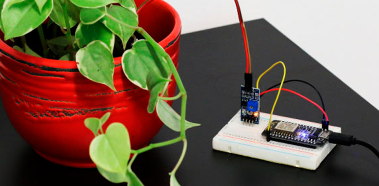

## **Sensores do arduíno**

O arduino possui diversos sensores os quais são usados em diversos projetos com o fito de construir protótipos de projetos. Veremos alguns tipos de sensores e componentes eletrônicos muito úteis, tais como

#### **Sensores  Abordados e componentes abordados**

* Sensor de umidade
* Sensor de distância
* Sensor de fluxo de água
* Sensor de gás
* Sensor de luminosidade
* Sensor de chuva
* Relé
* Motor de passos

##### **Como um sensor funciona no arduino?**
Quando trabalhamos com arduíno, devemos ter em mente que um sensor não é capaz de retornar dados através de qualquer unidade de medida conhecida. Assim, um sensor de temperatura não retorna uma temperatura em C, F ou K. Tudo que é retornado por qualquer sensor é uma determinda tensão.
Conhecendo essa tensão, que varia de 0V a 5V, o sensor nos fornece um método de mapear a tensão obtida de modo a converter a mesma para a unidade desejada
Além disso, no arduíno há ainda outra conversão: O arduíno não trabalha com as tensões em tipos __float__, ele mapeia todas as tensões de 0V a 5V para valores inteiros de 0 a 1023, ou seja, temos 10 bits de precisão no arduíno quando trabalhamos com os sensores. Essa precisão pode ser um problema em projetos reais, até por isso usamos o arduíno somente em determinados casos.

 
 

### Sensor de umidade 
O sensor de umidade é um importante sensor pois com ele podemos realizar projetos de automação embasados na umidade de algo, como a terra de um vaso por exemplo

um exemplo de projeto realizado com este sensor é um regador automático de plantas. Aqui, o sensor é usado junto com o arduíno para verificar a umidade da terra em que está uma planta. Se a umidade ficar muito baixa, regamos a planta automaticamente

 
 

