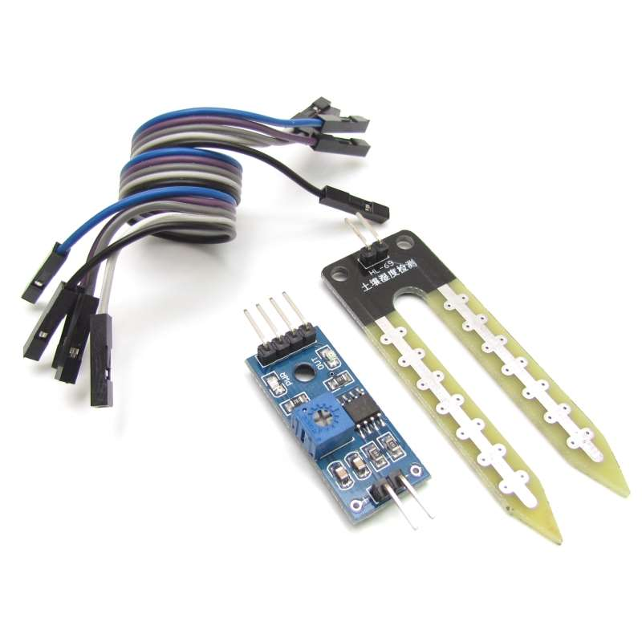

## **Sensores do arduíno**

O arduino possui diversos sensores os quais são usados em diversos projetos com o fito de construir protótipos de projetos. Veremos alguns tipos de sensores e componentes eletrônicos muito úteis, tais como

#### **Sensores  Abordados**

* Sensor de umidade
* Sensor de distância
* Sensor de fluxo de água
* Sensor de gás
* Sensor de luminosidade
* Sensor de chuva
* Relé
* Motor de passos

 
 

### Sensor de umidade 
O sensor de umidade é um importante sensor pois com ele podemos realizar projetos de automação embasados na umidade de algo, como a terra de um vaso por exemplo

