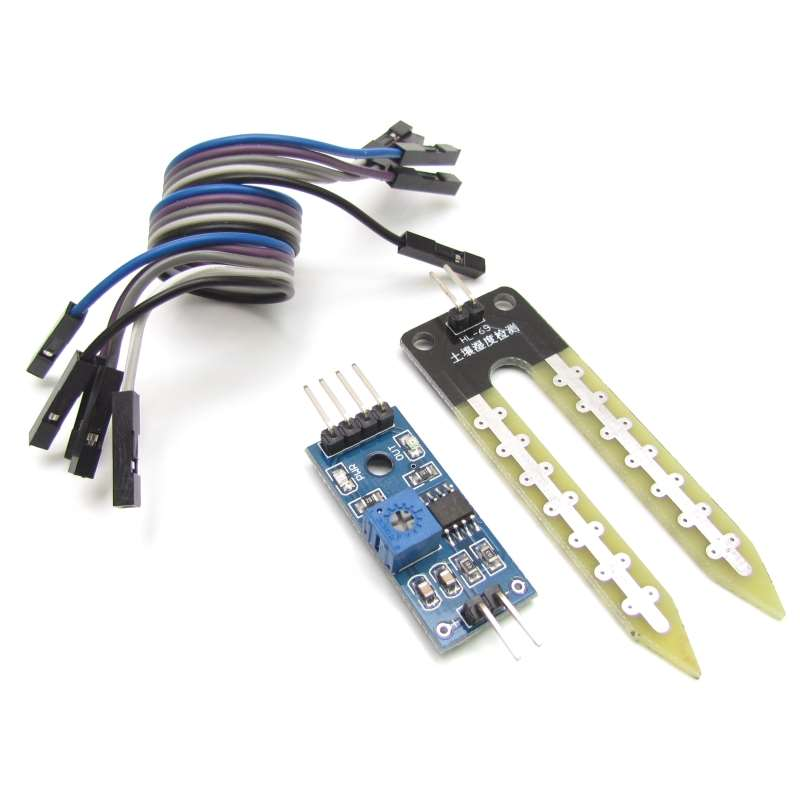
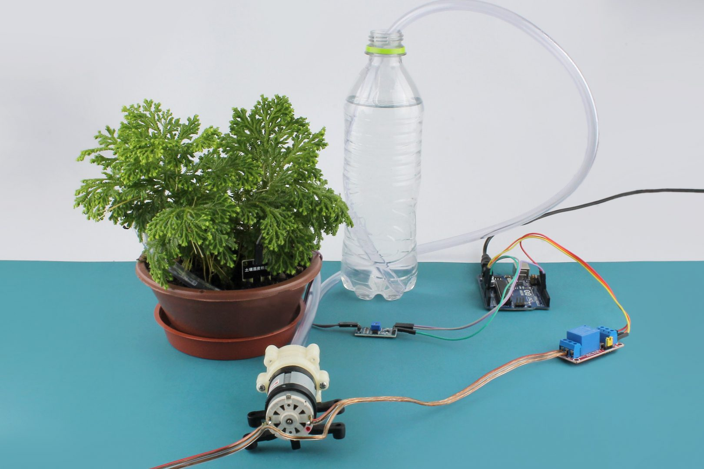
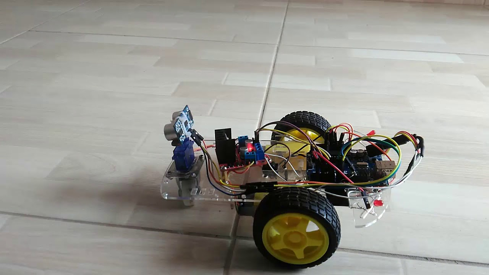
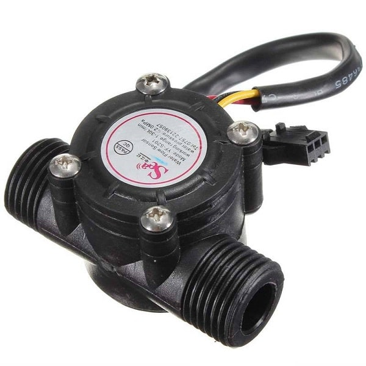
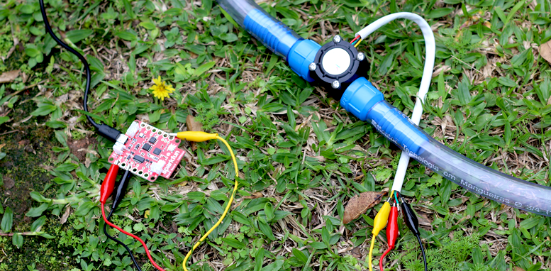
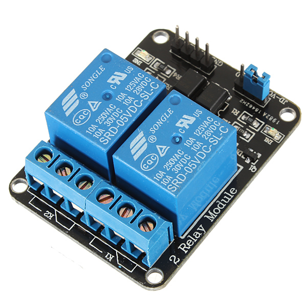
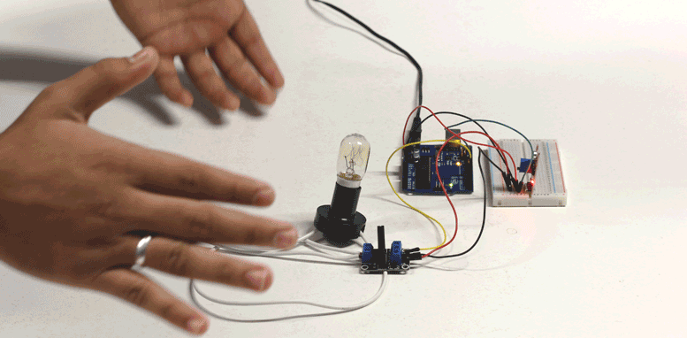
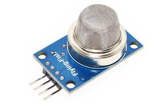
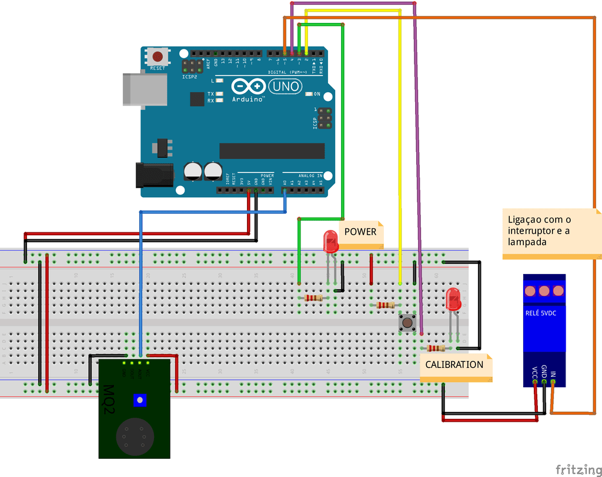
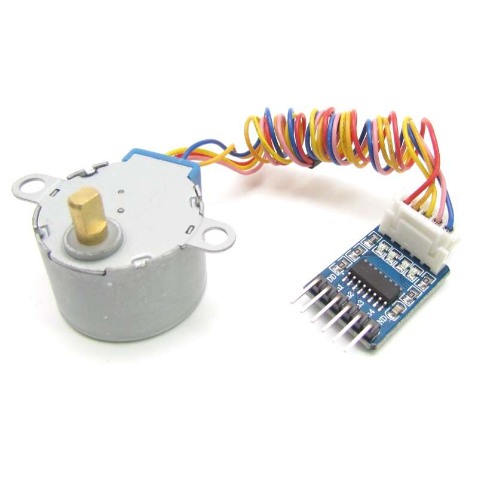

## **Sensores e componentes no arduíno**

O arduino possui diversos sensores os quais são usados em diversos projetos com o fito de construir protótipos de projetos. Veremos alguns tipos de sensores e componentes eletrônicos muito úteis, tais como

 

#### **Sensores e componentes abordados**

* Sensor de umidade
* Sensor de distância
* Sensor de fluxo de água
* Relé
* Sensor de gás
* Motor de passos

 

#### **Como um sensor funciona no arduino?**
Quando trabalhamos com arduíno, devemos ter em mente que um sensor não é capaz de retornar dados através de qualquer unidade de medida conhecida. Assim, um sensor de temperatura não retorna uma temperatura em C, F ou K. Tudo que é retornado por qualquer sensor é uma determinda tensão. 
Conhecendo essa tensão, que varia de 0V a 5V, o sensor nos fornece um método de mapear a tensão obtida de modo a converter a mesma para a unidade desejada. 
Além disso, no arduíno há ainda outra conversão: O arduíno não trabalha com as tensões em tipos __float__, ele mapeia todas as tensões de 0V a 5V para valores inteiros de 0 a 1023, ou seja, temos 10 bits de precisão no arduíno quando trabalhamos com os sensores. Essa precisão pode ser um problema em projetos reais, até por isso usamos o arduíno somente em determinados casos.

 
 
 

### Sensor de umidade 
O sensor de umidade é um importante sensor pois com ele podemos realizar projetos de automação embasados na umidade de algo, como a terra de um vaso por exemplo

 

#### Projeto regador automático
um exemplo de projeto realizado com este sensor é um regador automático de plantas. Aqui, o sensor é usado junto com o arduíno para verificar a umidade da terra em que está uma planta. Se a umidade ficar muito baixa, regamos a planta automaticamente

 
 
 

### Sensor de distância
O sensor de distância é um dos sensores mais versáteis que temos no arduíno. Há uma quantidade enorme de projetos que podemos fazer usando-os.
Os sensores mais comuns e baratos conseguem fazer detecções a até cerca de 1 metro de distância, mas há outros sensores muito mais potentes que podem ser usados

#### Projeto carrinho que não se choca com as paredes
Um ótimo exemplo do uso deste sensor é visto no projeto de um carrinho que não se choca contra as paredes. Para fazer isso, usamos o sensor de distância para prevenir o carrinho de se aproximar de mais, e consequente bater, na parede.

 

 
 
 

### Sensor de fluxo de água
Um sensor de fluxo de água é muito importante e fornece diversas opções de projetos, 
 principalmente quando queremos interromper a passagem de um determinado liquido depois que passou um determinadoro volume do mesmo

<!--  -->

 

#### Projeto economia de água
Um exemplo de projeto muito interessante e sustentável é um medidor de consumo de água, onde o usuário consegue monitorar 
seu consumo de água e definir metas de consumo, de modo que se esse valor for extrapolado, o usário seja notificado. Deste modo,  
o usuário se conscientiza mais do seu uso abusivo e pode mitiga-lo.

 
 
 

### Relé
O relé é sem dúvida um dos componentes eletrônicos mais interessantes quando falamos de arduino. O relé é basicamente um interruptor eletrônico, ou seja, um interruptor que podemos acionar eletricamente e desse modo, com o arduino podemos controlar o relé, e o relé pode ser ligado a uma corrente muito mais alta, com 127V das casas e desse modo, podemos ligar aparelhos que demandam muito mais corente usando o arduino e o relé

 

#### Projeto ligando a casa com palmas
Talvez um dos mais divertidos projetos que podem ser feitos com um relé é ligar os aparelhos eletronicos de uma casa batendo palmas ou emitindo utros sons, para isso, conectamos o relé a o aparelho desejado e usamos um sensor de ruído para verificar se houve um som de batida de palmas. Se sim, podemos fazer com que o relé se ative!

 
 
 

### Sensor de gás
o sensor de gás é muito útil, pois com ele podemos verificar se há presença de gás em um certo ambiente, isso nos possibilita
diversos ganhos, pois assim podemos dentre outras coisas, tornar um ambiente mais seguro, posto que muitos acidentes ocorrem
quando o indivíduo não sente o cheiro do gás.

 

#### Projeto interruptor com sensor de gás
Um projeto nessa linha é o de construir um interruptor com o sensor de gás, de modo que, quando seja detectado um vazamento de gás,
os interruptores da casa sejam desabilitados usando um relé, prevenindo o usuário de tentar acendê-los sem querer e ocasionar um acidente

 
 
 

### Motor de passos
O motor de passos é por certo um dos componentes mais interessantes quando falamos de arduíno e afins.  
Um motor de passos é um motor que podemos ajustar o ângulo de rotação com uma precisão imensa, isso nos possibilita quase que infinitas aplicações, principalmente quando vamos fazer algo que exige grande precisão, como construir uma impressora 3D ou meso uma cortadora a laser.

 

#### Projeto robô desenhista
Talvez um dos projetos mais divertidos com esse componente seja um robô desenhista, ou seja, um robô capaz de fazer desenhos em uma superfície usando uma caneta

