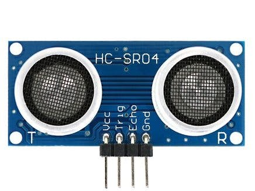

## **Sensores e componentes no arduíno**

O arduino possui diversos sensores os quais são usados em diversos projetos com o fito de construir protótipos de projetos. Veremos alguns tipos de sensores e componentes eletrônicos muito úteis, tais como

 

#### **Sensores  Abordados e componentes abordados**

* Sensor de umidade
* Sensor de distância
* Sensor de fluxo de água
* Sensor de gás
* Sensor de luminosidade
* Sensor de chuva
* Relé
* Motor de passos

 

#### **Como um sensor funciona no arduino?**
Quando trabalhamos com arduíno, devemos ter em mente que um sensor não é capaz de retornar dados através de qualquer unidade de medida conhecida. Assim, um sensor de temperatura não retorna uma temperatura em C, F ou K. Tudo que é retornado por qualquer sensor é uma determinda tensão. 
Conhecendo essa tensão, que varia de 0V a 5V, o sensor nos fornece um método de mapear a tensão obtida de modo a converter a mesma para a unidade desejada. 
Além disso, no arduíno há ainda outra conversão: O arduíno não trabalha com as tensões em tipos __float__, ele mapeia todas as tensões de 0V a 5V para valores inteiros de 0 a 1023, ou seja, temos 10 bits de precisão no arduíno quando trabalhamos com os sensores. Essa precisão pode ser um problema em projetos reais, até por isso usamos o arduíno somente em determinados casos.

 
 
 

### Sensor de umidade 
O sensor de umidade é um importante sensor pois com ele podemos realizar projetos de automação embasados na umidade de algo, como a terra de um vaso por exemplo

 

#### Projeto regador automático
um exemplo de projeto realizado com este sensor é um regador automático de plantas. Aqui, o sensor é usado junto com o arduíno para verificar a umidade da terra em que está uma planta. Se a umidade ficar muito baixa, regamos a planta automaticamente

 
 
 

### Sensor de distância
O sensor de distância é um dos sensores mais versáteis que temos no arduíno. Há uma quantidade enorme de projetos que podemos fazer usando-os.
Os sensores mais comuns e baratos conseguem fazer detecções a até cerca de 1 metro de distância, mas há outros sensores muito mais potentes que podem ser usados

#### Projeto carrinho que não se choca com as paredes
Um ótimo exemplo do uso deste sensor é visto no projeto de um carrinho que não se choca contra as paredes. Para fazer isso, usamos o sensor de distância para prevenir o carrinho de se aproximar de mais, e consequente bater, na parede.

 

 
 
 

### Sensor de fluxo de água
Um sensor de fluxo de água é muito importante e fornece diversas opções de projetos, 
 principalmente quando queremos interromper a passagem de um determinado liquido depois que passou um determinadoro volume de um certo liquido

<!--  -->

 

#### Projeto ecomia de água
Um exemplo de projeto muito interessante e sustentável é um medidor de consumo de água, onde o usuário consegue monitorar </>
seu consumo de água e definir metas de consumo, de modo que se esse valor for extrapolado, o usário seja notificado. Deste modo,  
o usuário se conscientiza mais do seu uso abusivo e pode mitiga-lo.

